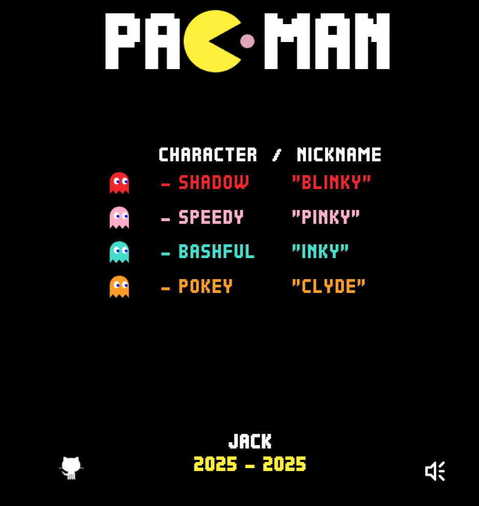

# Succinct Pac-Man Zero-Knowledge Proof Game

A classic Pac-Man game implementation with SP1 zero-knowledge proof integration for cryptographic verification of game scores. The game features a modern UI, responsive design, and secure proof generation system.



## 🎮 Game Features

- Classic Pac-Man gameplay with modern UI/UX
- Responsive design for all devices
- Sound effects and visual feedback
- Power pellets and ghost interactions
- Score tracking and high score system
- SP1 zero-knowledge proof integration
- Cryptographic verification of game scores
- Real-time proof generation with visual feedback

## 🛠 Technical Stack

- Frontend: HTML5, CSS3, JavaScript, jQuery
- Game Engine: Canvas-based rendering
- Backend: Node.js with Express
- Zero-Knowledge Proof: SP1 SDK
- API: RESTful endpoints for proof generation

## 🚀 Getting Started

### Prerequisites

- Node.js (v14 or higher)
- Nginx (for production deployment)
- Python 3.8+ (for local development)

#### SP1 Requirements
SP1 currently runs on Linux and macOS. You can either use prebuilt binaries through sp1up or build the [Succinct Rust toolchain](https://rust-lang.github.io/rustup/concepts/toolchains.html) and CLI from source.

Required tools:
- Git
- Rust (Nightly)
- Docker

### Installation

1. Clone the repository:
```bash
git clone https://github.com/trsonfu/succinct-pac-man.git
cd succinct-pac-man
```

2. Install SP1 tools:
```bash
curl -L https://sp1up.succinct.xyz | bash
sp1up
```

3. Install Node.js dependencies:
```bash
npm install
```

### Local Development

1. Start the development server:
```bash
npm start
```

2. Open your browser at `http://localhost:3000`

### Production Deployment

#### Backend Setup

1. Navigate to the backend directory:
```bash
cd server
```

2. Install dependencies:
```bash
npm install
```

3. Configure environment variables:
```bash
cp .env.example .env
# Edit .env with your configuration
```

4. Start the backend server:
```bash
npm start
```

#### Frontend Setup

1. Navigate to the frontend directory:
```bash
cd web
```

2. Install dependencies:
```bash
npm install
```

3. Build the frontend:
```bash
npm run build
```

4. Create Nginx File (For Ubuntu Server Deploy):
```bash
nano /etc/nginx/sites-available/pacman/
```
5. Nginx config
```bash
server {
    listen 80;
    server_name yor_domain;

    root /var/www/succinct-pac-man/web;
    index index.html;

    location / {
        try_files $uri $uri/ =404;
    }

    location /api/prove {
        proxy_pass http://127.0.0.1:8080/prove;
        proxy_http_version 1.1;
        proxy_set_header Host $host;
        proxy_set_header X-Real-IP $remote_addr;
        proxy_set_header X-Forwarded-For $proxy_add_x_forwarded_for;
    }

    # CORS headers
    add_header 'Access-Control-Allow-Origin' '*' always;
    add_header 'Access-Control-Allow-Methods' 'GET, POST, OPTIONS' always;
    add_header 'Access-Control-Allow-Headers' 'DNT,User-Agent,X-Requested-With,If-Modified-Since,Cache-Control,Content-Type,Range' always;
    add_header 'Access-Control-Expose-Headers' 'Content-Length,Content-Range' always;
}

```

6. Set up Nginx:
```bash
sudo ln -s /etc/nginx/sites-available/pacman.tempestcrypto.net /etc/nginx/sites-enabled/
sudo nginx -t
sudo systemctl restart nginx
```

7. Set proper permissions:
```bash
sudo chown -R www-data:www-data /var/www/succinct-pac-man
sudo chmod -R 755 /var/www/succinct-pac-man
```

## 📡 API Endpoints

### Generate Proof
```javascript
POST http://localhost:3000/api/prove
Content-Type: application/json

{
    "score": number
}
```

Response:
```json
{
    "proof_id": string,
    "cycles": number,
    "score": number
}
```

## 🎯 Game Rules

1. Control Pac-Man using arrow keys
2. Collect dots and power pellets to increase score
3. Avoid ghosts or eat them when powered up
4. Game ends when all lives are lost
5. Generate proof only after game over with positive score

## 🔒 Proof Generation

The game uses SP1 SDK to generate zero-knowledge proofs for game scores. Proofs are generated when:
- Game is over (all lives lost)
- Player has a positive score
- Player requests proof generation

## 🎨 UI Components

- Game board with responsive layout
- Score and high score display
- Lives counter
- Control buttons for mobile devices
- Help popup with game rules
- Proof generation popup with binary animation

## 🎵 Sound Effects

- Pac-Man movement
- Ghost interactions
- Power pellet collection
- Game over
- Level completion

## 📱 Mobile Support

- Touch controls for mobile devices
- Responsive design for all screen sizes
- Optimized performance for mobile browsers

## 🤝 Contributing

1. Fork the repository
2. Create your feature branch (`git checkout -b feature/AmazingFeature`)
3. Commit your changes (`git commit -m 'Add some AmazingFeature'`)
4. Push to the branch (`git push origin feature/AmazingFeature`)
5. Open a Pull Request

## 📄 License

This project is licensed under the MIT License - see the [LICENSE](LICENSE) file for details.

## 🙏 Acknowledgments

- Original Pac-Man game concept by Namco
- SP1 SDK by Succinct Labs
- Game assets and sound effects from public domain

## 👨‍💻 Author

- **Jack** - [trsonfu](https://github.com/trsonfu)